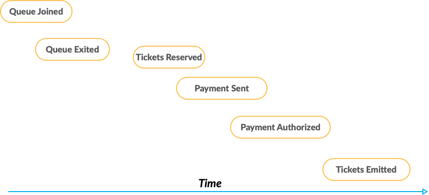
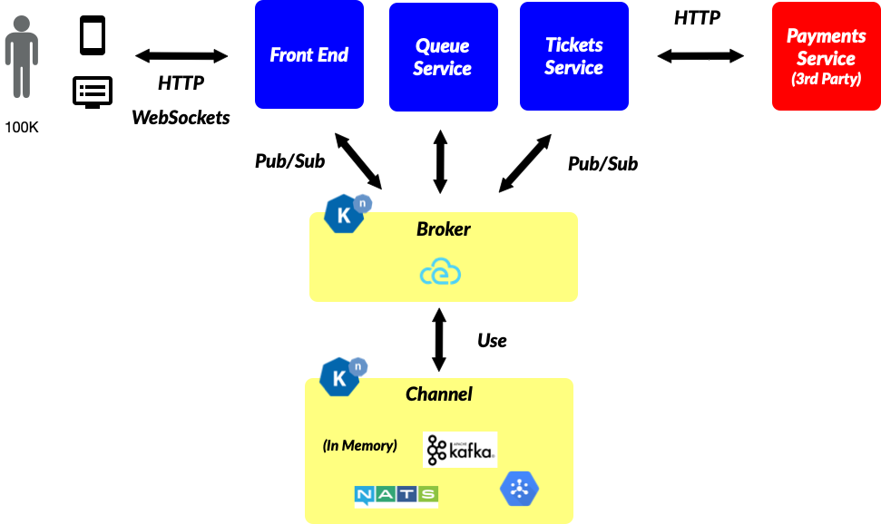
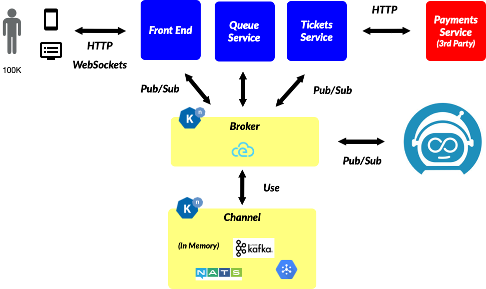
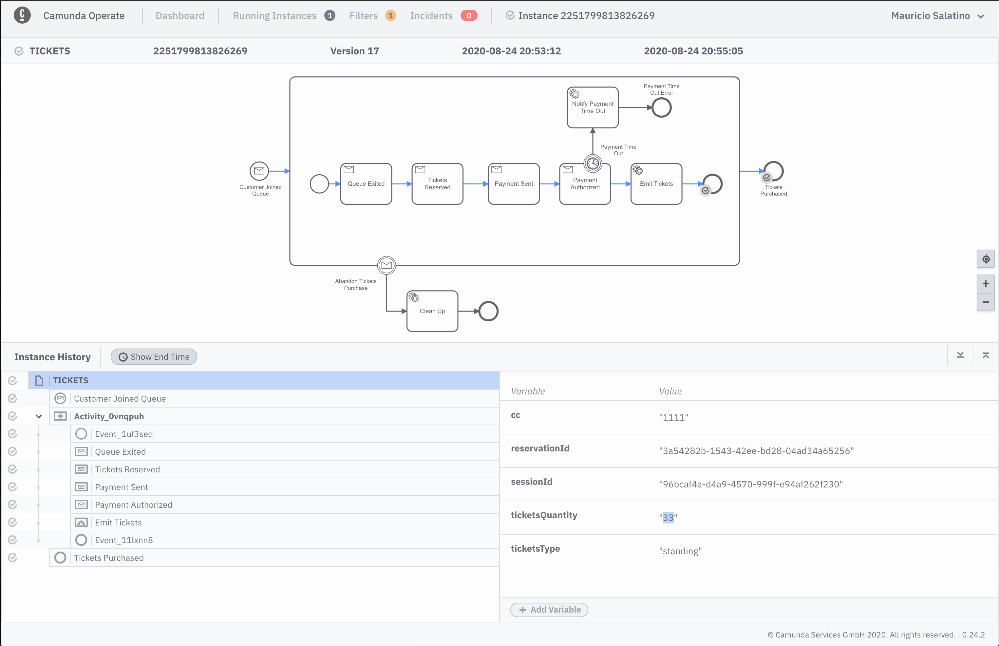
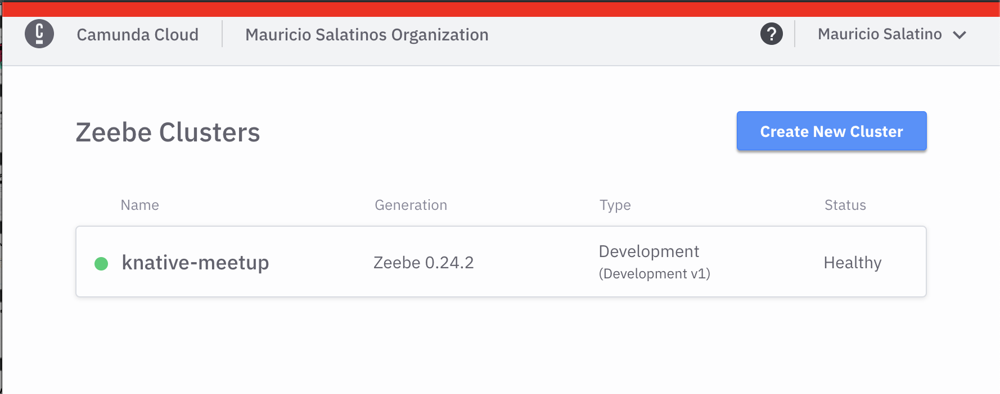
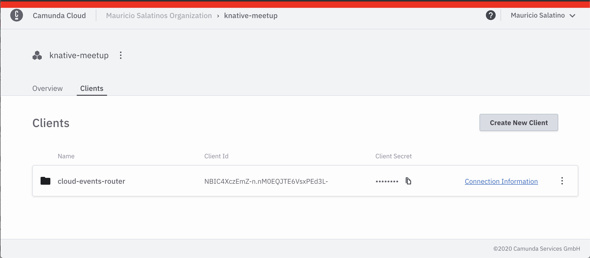

# Orchestrating Cloud Events

Orchestrating Cloud Events with Knative and Zeebe.

In this repository you will find all the resources for the talk named after this repository.

Source code for the example service:
- [User Interface](https://github.com/salaboy/customer-waiting-room-app)
- [Tickets Service](https://github.com/salaboy/tickets-service/)
- [Payments Service](https://github.com/salaboy/payments-service/)
- [Queue Service](https://github.com/salaboy/queue-service/)
- [Zeebe Cloud Events Router](https://github.com/zeebe-io/zeebe-cloud-events-router)
- [Zeebe Cloud Events Workflow Models](https://github.com/salaboy/zeebe-cloud-events-examples)

# Pre Requisites

- Kubernetes Cluster
- Helm 3.x installed and configured
- Install Knative 0.16.0
  - [Install Knative Serving](https://knative.dev/docs/install/any-kubernetes-cluster/#installing-the-serving-component)
  - [Install Knative Eventing](https://knative.dev/docs/install/any-kubernetes-cluster/#installing-the-eventing-component). Notice that you also need to install the **In Memory Channel** and the **MT-Channel-Based Broker** as instructed in the Knative Eventing Guides linked here. 
- [Camunda Cloud Account](https://camunda.com/products/cloud/) To run a Managed Zeebe Cluster for Orchestration. It is free to try. 
- Or use [Zeebe Helm Charts](http://helm.zeebe.io) to host your Zeebe Cluster for Orchestration
  
  
# Scenario
A tickets company is creating a new website to sell high-demand concert tickets. In such scenarios, tickets go on sale a predefined date at a certain time (Monday 9am for example). There is usually less tickets than people wanting to buy them, for example, 20K available tickets and 100K people waiting to buy them. 
The company needs to implement a Queue system to make sure that customers are served in a a first come/first served basis. 

# Architecture
After thinking for a while, one of the possible solitions might be to use an Event Driven Approach to architect the services behind the application. 
The application is composed by 4 Services as shown in the following diagram:

The events generated by different services inside the applications are: 

As you can see these events are repesenting a single sale of tickets, in other words, the events that will be emitted by a Customer going through the entire process of buying tickets for a particular concert. 

If we decide to use Knative the architecture look like this: 

For visibility and for orchestration you can just tap into the event stream with Zeebe/Camunda Cloud and the architecture doesn't change, you just have one more publisher/subscriber to the broker. 

If you decide to use Zeebe/Camunda Cloud now you have visibility and orchestration features at your disposal. You can use Camunda Operate, inside Camunda Cloud or installed by Zeebe Helm Charts to monitor and operate your orchestration flows:

# Install Services
All the services are packaged as Helm Charts and can be installed from the following Helm Repository, or built from source. 

> helm repo add zeebe-internal http://chartmuseum-jx.35.230.155.173.nip.io/charts/
> helm repo update

## Installing Tickets Service

> helm install tickets zeebe-internal/tickets-service

## Install Payments Service
> helm install payments zeebe-internal/payments-service

## Install Queue Serivce 

> helm install queue zeebe-internal/queue-service

## Install Front End

> helm install frontend zeebe-internal/customer-waiting-room-app

## Install Zeebe Cloud Events Router

Before installing the Zeebe Cloud Event Router you need to have a Zeebe Cluster ready to be able to provide the connection details to the Router. 
This component is in charge of routing Cloud Events in and out of the Zeebe Cluster and do the mappings between BPMN constructs and Event Types. More information about the [Zebee Cloud Events router here](https://salaboy.com/2020/05/18/orchestrating-cloud-events-with-zeebe/).

You can create a Zebee Cluster hosted in Camunda Cloud with a few clicks after registering. 

Once you create the Cluster you need to create the client credentials, you can have multiple clients connecting to the Zeebe Cluster. 

Once the Client is created you can access the **Connection Information** that you will use in the next step

Depending if you are going to use a Camunda Cloud Account or your hosted Zeebe Cluster you will need to change the ENVIRONMENT variables provided to the following command: 

> helm install cloud-events-router --set env.ZEEBE_CLIENT_BROKER_CONTACTPOINT=**<CONTACT_POINT>** --set env.ZEEBE_CLIENT_ID=**<CLIENT_ID>** --set env.ZEEBE_CLIENT_SECRET=**<CLIENT_SECRET>** --set env.ZEEBE_AUTHORIZATION_SERVER_URL=https://login.cloud.camunda.io/oauth/token --set env.ZEEBE_CLIENT_SECURITY_PLAINTEXT=false zeebe-internal/zeebe-cloud-events-router

**CLIENT_ID**, **CLIENT_SECRET>** and **<CONTACT_POINT>** can be obtained after creating a Cluster in Camunda Cloud and then creating a Client, as shown in the  screens above. 

## Checking that all your services are correctly installed

If you run `helm list` you should get the following (or similar) output:

If you run `kubectl get ksvc` (Knative Services) you should see two `payments-service` and `customer-waiting-room-app` which is our frontend:

Finally, if you run `kubectl get pods` you should see all the pods and replicas for the services, by default they are configured to have just a single replica. The two Knative Services (payments and frontend) have two containers inside the pod, as Knative automatically inject a sidecar (proxy container) to route traffic.

# Questions? Issues? want to contribute to make it better?  Please get in touch

If you have questions please create in issue in this repository or drop me a message in [twitter @salaboy](http://twitter.com/salaboy)

