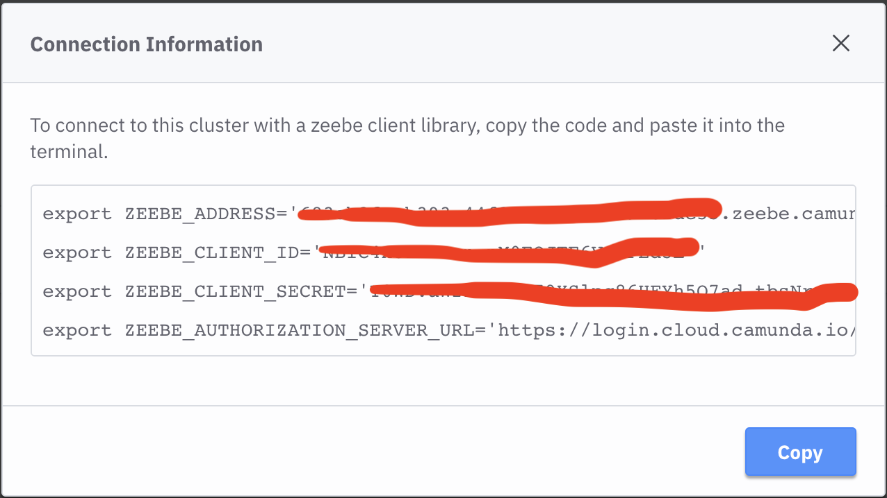

# Orchestrating Cloud Events

Orchestrating Cloud Events with Knative and Zeebe.

In this repository you will find all the resources for the talk named after this repository.

Source code for the example service:
- [User Interface](https://github.com/salaboy/customer-waiting-room-app)
- [Tickets Service](https://github.com/salaboy/tickets-service/)
- [Payments Service](https://github.com/salaboy/payments-service/)
- [Queue Service](https://github.com/salaboy/queue-service/)
- [Zeebe Cloud Events Router](https://github.com/zeebe-io/zeebe-cloud-events-router)
- [Zeebe Cloud Events Workflow Models](https://github.com/salaboy/zeebe-cloud-events-examples)

# Pre Requisites

- Kubernetes Cluster
- Helm 3.x installed and configured
- Install Knative 0.16.0
  - [Install Knative Serving](https://knative.dev/docs/install/any-kubernetes-cluster/#installing-the-serving-component)
  - [Install Knative Eventing and In Memory Channel](https://knative.dev/docs/install/any-kubernetes-cluster/#installing-the-eventing-component)
- [Camunda Cloud Account](https://camunda.com/products/cloud/) To run a Managed Zeebe Cluster for Orchestration. It is free to try. 
- Or use [Zeebe Helm Charts](http://helm.zeebe.io) to host your Zeebe Cluster for Orchestration

  
 
  
# Install Services
All the services are packaged as Helm Charts and can be installed from the following Helm Repository, or built from source. 

> helm repo add zeebe-internal http://chartmuseum-jx.35.230.155.173.nip.io/charts/
> helm repo update

## Installing Tickets Service

> helm install tickets zeebe-internal/tickets-service

## Install Payments Service
> helm install payments zeebe-internal/payments-service

## Install Queue Serivce 

> helm install queue zeebe-internal/queue-service

## Install Front End

> helm install frontend zeebe-internal/customer-waiting-room-app

## Install Zeebe Cloud Events Router

Before installing the Zeebe Cloud Event Router you need to have a Zeebe Cluster ready to be able to provide the connection details to the Router. 
This component is in charge of routing Cloud Events in and out of the Zeebe Cluster and do the mappings between BPMN constructs and Event Types. More information about the [Zebee Cloud Events router here](https://salaboy.com/2020/05/18/orchestrating-cloud-events-with-zeebe/).

You can create a Zebee Cluster hosted in Camunda Cloud with a few clicks after registering. 

Once you create the Cluster you need to create the client credentials, you can have multiple clients connecting to the Zeebe Cluster. 

Once the Client is created you can access the **Connection Information** that you will use in the next step

Depending if you are going to use a Camunda Cloud Account or your hosted Zeebe Cluster you will need to change the ENVIRONMENT variables provided to the following command: 

> helm install cloud-events-router --set env.ZEEBE_CLIENT_BROKER_CONTACTPOINT=**<CONTACT_POINT>** --set env.ZEEBE_CLIENT_ID=**<CLIENT_ID>** --set env.ZEEBE_CLIENT_SECRET=**<CLIENT_SECRET>** --set env.ZEEBE_AUTHORIZATION_SERVER_URL=https://login.cloud.camunda.io/oauth/token --set env.ZEEBE_CLIENT_SECURITY_PLAINTEXT=false zeebe-internal/zeebe-cloud-events-router

**CLIENT_ID**, **CLIENT_SECRET>** and **<CONTACT_POINT>** can be obtained after creating a Cluster in Camunda Cloud and then creating a Client, as shown in the  screens above. 

